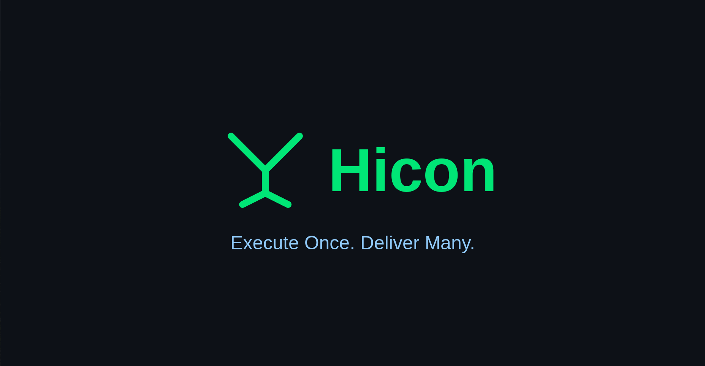
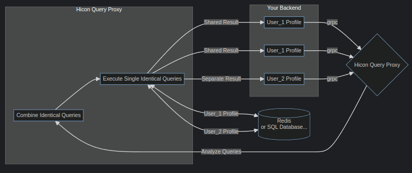

## [Flowchart]

## Why Hicon?
- Hicon is a solution that provides optimization techniques such as caching and connection pooling to improve application performance.
- It also supports multiple databases including MySQL and PostgreSQL, making it easy to integrate with existing systems or add new ones as needed. Additionally, its built-in query builder ensures secure access to sensitive information stored within those databases. Finally, its ability to combine similar queries together reduces overhead costs associated with running multiple requests simultaneously.
- Hicon is designed to be fast and efficient by minimizing the number of database queries made during each operation. This allows developers to build applications that can handle large amounts of data without sacrificing performance or scalability.
- Overall, Hicon offers a powerful set of features that make it ideal for building scalable web applications that require robust database integration capabilities. Whether you're working on a small project or something more ambitious, this tool will help streamline your workflow while ensuring optimal performance throughout development cycles.

## Features

- [x] Built-in query builder based on BunORM for security.
- [x] Communicate through GRPC.
- [x] Combine identical queries in the same time into single query.
- [x] Cache connections in pool.
- [x] Support for multi DBs: MySQL, Postgresql.
- [x] Connect with your Redis for better performance.
- [x] Optimized Redis cache size.
- [x] Client SDK for Node.js, Golang.
- [x] Disable cache at global and per request.
- [x] Custom your lock key with write actions.
- [x] Bulk write operations with transactions.

## Backlogs

- [ ] Unit test.
- [ ] SDK for PHP, C#, Ruby, Java...
- [ ] OpenTelemetry.
- [ ] Optimize for pagination.
- [ ] Debug logging with your X-Request-Id.
